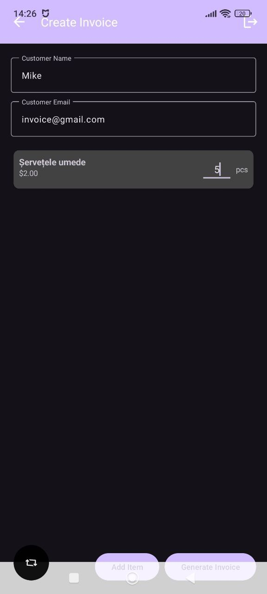

# Aplicație de Facturare pentru Android

## Ce face această aplicație?
O aplicație simplă pentru telefoanele Android care te ajută să:
- Creezi facturi ușor și rapid
- Ții evidența produselor tale
- Scanezi coduri de bare pentru produse
- Trimiți facturi direct prin email

## Cum arată?

## Cum o folosești?

### Pentru Produse
1. Apasă pe "Gestionare Produse"
2. Poți adăuga produse în două moduri:
   - Apasă "Adaugă Produs" și completează detaliile
   - Apasă "Scanează" pentru a scana codul de bare

### Pentru Facturi
1. Apasă pe "Creare Factură"
2. Completează numele și emailul clientului
3. Adaugă produsele dorite
4. Apasă "Generează Factură"
5. Trimite factura prin email sau salvează-o

## Ce poți face în aplicație?

### Gestionare Produse
- Adaugi produse noi
- Vezi lista cu toate produsele
- Scanezi coduri de bare
- Modifici cantitatea și prețul

### Facturi
- Creezi facturi noi
- Adaugi produse în factură
- Generezi PDF-ul facturii
- Trimiți factura prin email

## Ce trebuie să ai ca să meargă aplicația?
- Telefon Android (minim Android 6.0)
- Cameră foto pentru scanare (opțional)
- Spațiu liber: minim 50MB

## Probleme Cunoscute și Rezolvări

### Nu merge scanarea?
- Verifică dacă ai dat permisiune pentru cameră
- Asigură-te că ai cameră la telefon
- Încearcă să repornești aplicația

### Nu poți crea factură?
- Verifică dacă ai completat toate câmpurile necesare
- Asigură-te că ai adăugat cel puțin un produs
- Verifică dacă ai spațiu în telefon

## Ce urmează?
Vom adăuga:
- Salvare în cloud
- Mai multe modele de factură
- Statistici de vânzări
- Traduceri în alte limbi

## Licență
Licențe open-source.
